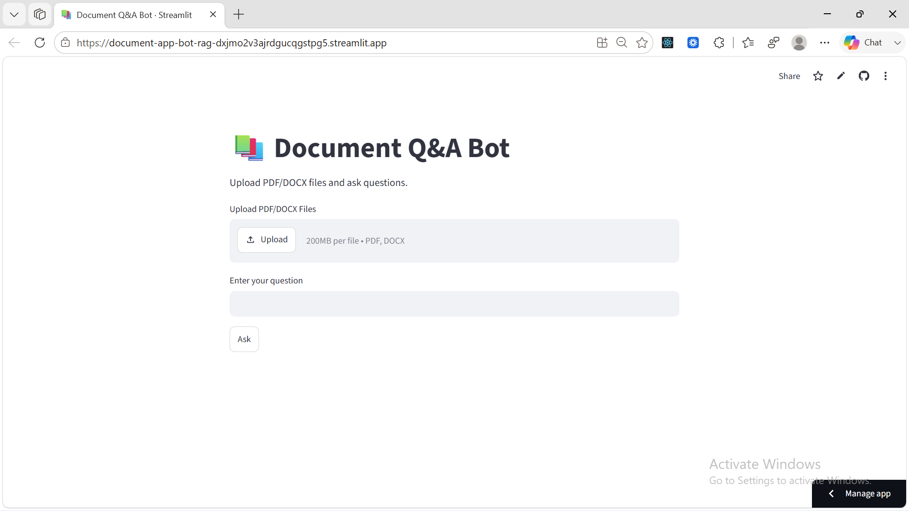
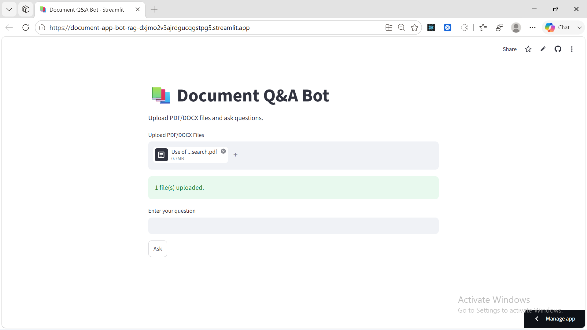
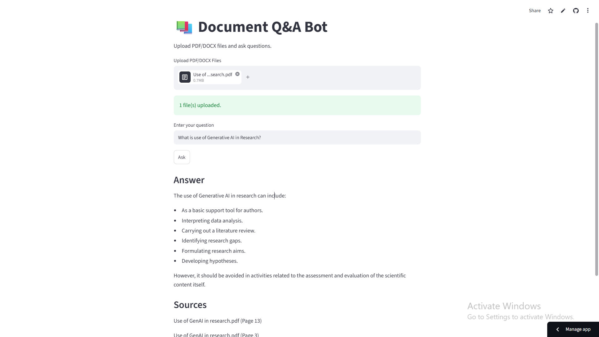
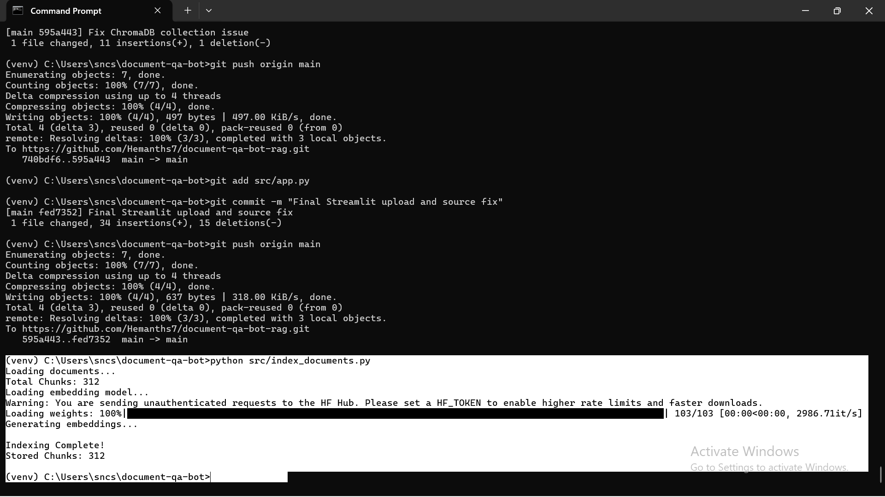
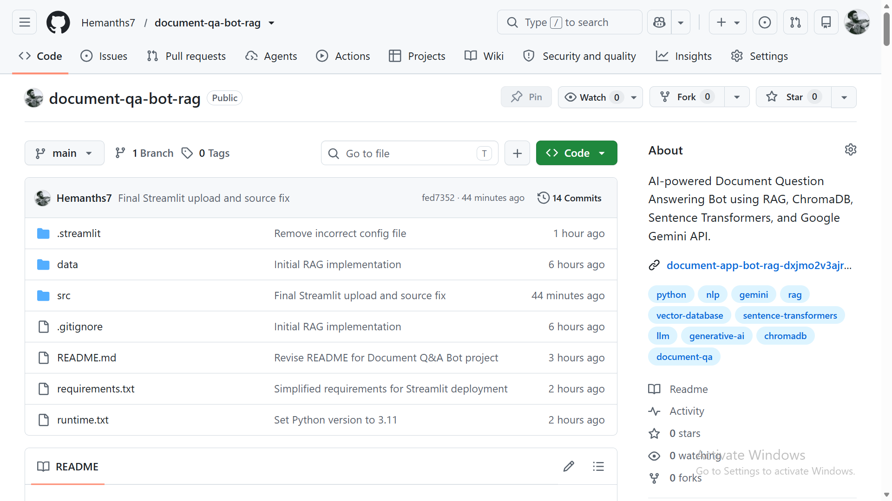

# 📚 Document Q&A Bot using RAG (Retrieval-Augmented Generation)

A Retrieval-Augmented Generation (RAG) based Question Answering system that enables users to upload PDF and DOCX documents, ask natural language questions, and receive accurate answers grounded in the uploaded content.

The application extracts document text, chunks it into smaller segments, generates embeddings, retrieves the most relevant information using vector search, and uses Google Gemini to generate context-aware answers with source citations.

---

# 🚀 Live Demo

### Streamlit Application

https://document-app-bot-rag-dxjmo2v3ajrdgucqgstpg5.streamlit.app/

### GitHub Repository

https://github.com/Hemanths7/document-qa-bot-rag

---

# 📸 Screenshots

## Home Page



## Upload Documents



## Answer Generation



## Indexing Process



## Project Structure



---

# 🎯 Assignment Objective

Build a complete Retrieval-Augmented Generation (RAG) pipeline capable of:

* Document ingestion
* Text chunking
* Embedding generation
* Vector database storage
* Semantic retrieval
* LLM-based answer generation
* Source citation generation

---

# 📂 Project Structure

```text
document-qa-bot-rag/
│
├── data/
│   ├── AI INDEX REPORT 2025.pdf
│   ├── AI RISK MANAGEMENT FRAMEWORK.pdf
│   ├── NCSC_Quick_Guide_Phishing.docx
│   ├── The-Game-of-Cricket.docx
│   └── Use of GenAI in research.pdf
│
├── screenshots/
│
├── src/
│   ├── app.py
│   ├── ingest.py
│   ├── index_documents.py
│   ├── query.py
│   └── config.py
│
├── requirements.txt
├── runtime.txt
├── README.md
└── .env
```

---

# 🏗 Architecture Overview

```text
Documents (PDF / DOCX)
          │
          ▼
Document Ingestion
          │
          ▼
Text Extraction
          │
          ▼
Chunking
          │
          ▼
Embedding Generation
(all-MiniLM-L6-v2)
          │
          ▼
ChromaDB Vector Store
          │
          ▼
Similarity Search
          │
          ▼
Retrieved Chunks
          │
          ▼
Google Gemini 2.5 Flash
          │
          ▼
Answer + Citations
```

---

# ⚙️ Tech Stack & Versions

| Component             | Version |
| --------------------- | ------- |
| Python                | 3.11    |
| Streamlit             | 1.58.0  |
| ChromaDB              | 1.5.9   |
| Sentence Transformers | 5.6.0   |
| Google GenAI          | 2.9.0   |
| PyPDF                 | 6.13.3  |
| python-docx           | 1.2.0   |
| Torch                 | 2.12.1  |
| python-dotenv         | 1.2.2   |

---

# 📄 Knowledge Base Documents

The application uses the following documents:

1. AI INDEX REPORT 2025.pdf
2. AI RISK MANAGEMENT FRAMEWORK.pdf
3. NCSC_Quick_Guide_Phishing.docx
4. The-Game-of-Cricket.docx
5. Use of GenAI in research.pdf

These documents cover multiple domains:

* Artificial Intelligence
* Cyber Security
* Research Methodology
* Sports
* AI Governance

---

# ✂️ Chunking Strategy

### Strategy Used

Fixed-size chunking with overlap.

```python
chunk_size = 1000
chunk_overlap = 200
```

### Why This Strategy?

* Preserves contextual information between chunks.
* Reduces information loss at chunk boundaries.
* Improves retrieval quality.
* Simple and effective for beginner RAG systems.

### Metadata Stored

Each chunk stores:

* Source filename
* Page number

---

# 🧠 Embedding Model

### Model Used

```text
all-MiniLM-L6-v2
```

### Why This Model?

* Lightweight and fast
* Strong semantic similarity performance
* Popular embedding model for RAG applications
* Suitable for real-time retrieval systems

### Batch Embedding

Embeddings are generated in batches:

```python
texts = [chunk["text"] for chunk in chunks]
embeddings = model.encode(texts)
```

This improves performance compared to embedding chunks individually.

---

# 🗄 Vector Database

### Database Used

ChromaDB

### Why ChromaDB?

I selected ChromaDB because it is lightweight, open-source, easy to integrate with Python, supports vector similarity search, and is widely used in RAG systems. It provides efficient retrieval and is well-suited for document-based question-answering applications.

---

# 🔄 RAG Workflow

### Step 1

Upload PDF or DOCX documents.

### Step 2

Extract text from documents.

### Step 3

Split text into overlapping chunks.

### Step 4

Generate embeddings using Sentence Transformers.

### Step 5

Store embeddings in ChromaDB.

### Step 6

Accept user question.

### Step 7

Generate query embedding.

### Step 8

Retrieve Top-K relevant chunks.

### Step 9

Pass retrieved context and question to Google Gemini.

### Step 10

Generate answer with source citations.

---

# 🔑 Environment Variables

Create a `.env` file in the project root:

```env
GEMINI_API_KEY=YOUR_API_KEY
```

Get your API key from Google AI Studio.

⚠️ Never commit API keys to GitHub.

---

# 🛠 Installation & Setup

### Clone Repository

```bash
git clone https://github.com/Hemanths7/document-qa-bot-rag.git
```

### Move into Project

```bash
cd document-qa-bot-rag
```

### Create Virtual Environment

```bash
python -m venv venv
```

### Activate Virtual Environment

Windows:

```bash
venv\Scripts\activate
```

### Install Dependencies

```bash
pip install -r requirements.txt
```

---

# ▶ Running the Application

Launch Streamlit:

```bash
streamlit run src/app.py
```

Open:

```text
http://localhost:8501
```

---

# 💡 Example Queries

| Question                                                 | Expected Theme                           |
| -------------------------------------------------------- | ---------------------------------------- |
| What is phishing?                                        | Cyber security attacks and prevention    |
| How can Generative AI assist research?                   | Literature review, hypothesis generation |
| What is an AI Risk Management Framework?                 | AI governance and risk controls          |
| What insights are discussed in the AI Index Report 2025? | AI trends and industry developments      |
| How many players are there in a cricket team?            | Cricket rules and gameplay               |

---

# 📌 Sample Output

### Question

```text
What is phishing?
```

### Answer

```text
Phishing is a cyber attack in which attackers impersonate trusted entities to steal sensitive information such as passwords, banking details, or personal information.
```

### Source

```text
NCSC_Quick_Guide_Phishing.docx (Page 1)
```

---

# ⚠️ Known Limitations

* OCR support for scanned PDFs is not implemented.
* Retrieval quality depends on chunk quality.
* Large documents may increase processing time.
* Multi-document reasoning can be improved further.
* Answers depend on the relevance of retrieved chunks.
* The application currently supports PDF and DOCX documents only.

---

# 🎥 Demonstration Video

The demonstration video covers:

* Project structure walkthrough
* Document ingestion
* Chunking and indexing
* Streamlit application usage
* Five example queries
* Source citation display
* Handling unanswerable questions
* Technical design decisions

---

# 👨‍💻 Author

**Hemanth Shivarathri**

B.Tech – Computer Science & Engineering

JB Institute of Engineering and Technology

Hyderabad, India

GitHub: https://github.com/Hemanths7

---

# ✅ Assignment Requirements Covered

* Document Ingestion
* PDF Support
* DOCX Support
* Text Chunking
* Chunk Overlap
* Metadata Storage
* Batch Embeddings
* ChromaDB Vector Database
* Similarity Search
* Retrieval-Augmented Generation
* Google Gemini Integration
* Grounded Answer Generation
* Source Citations
* Streamlit Web UI
* Public GitHub Repository
* Cloud Deployment
